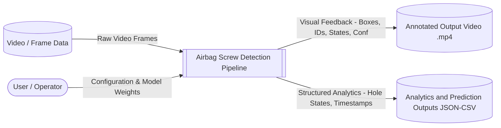
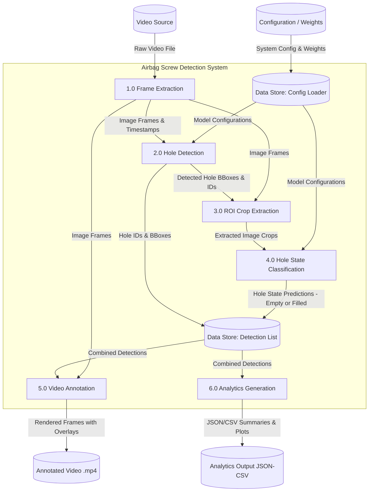
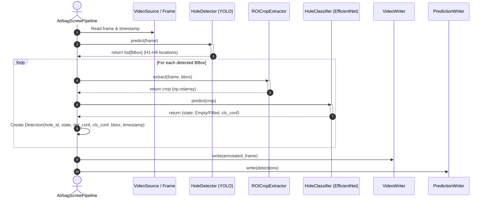
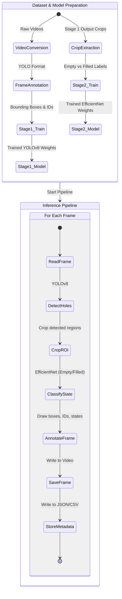

# Airbag Screw Detection System Design & Architecture

This document presents the comprehensive system architecture, Data Flow Diagrams (DFD), Low-Level Design (LLD), and UML diagrams for the **Airbag Screw Detection** system. The design is based on the assignment specifications and the structural components outlined in `lld_class_diagram_full.svg`.

---

## 1. Project Overview & Requirements

The goal of this system is to build an automated computer vision pipeline that processes video data of airbag panels to:
1. **Detect screw holes** (identifying hole IDs from **H1 to H9**).
2. **Classify each hole's state** as either **Empty** or **Filled**.
3. **Generate visual overlays** on the output video showing:
   - Bounding boxes around each screw hole.
   - Associated Hole IDs.
   - Estimated state (Empty/Filled).
   - Detection/classification confidence scores.
4. **Save structured analytics** including:
   - JSON/CSV formatted predictions with fields: `hole_id`, `state`, and `timestamp`.
   - Aggregate statistics such as per-hole fill rate and trend plots.

The architecture adopts a two-stage computer vision design:
- **Stage 1 (Detection)**: Uses a YOLO-based detector to identify regions of interest (ROI) and localize/identify hole IDs.
- **Stage 2 (Classification)**: Extracts cropped ROI images and uses an EfficientNet classifier to predict the state (Empty/Filled) of the localized holes.

---

## 2. Data Flow Diagrams (DFD)

Data Flow Diagrams model how information moves through the system, indicating sources, sinks, processing nodes, and data stores.

### Level 0: Context Data Flow Diagram
The Context Diagram represents the system boundary, showing inputs from external entities and outputs generated by the pipeline.

---

### Level 1: Functional Data Flow Diagram
The Level 1 Diagram breaks down the pipeline into distinct functional modules, showing internal data flows and stores.

---

## 3. UML Diagrams

UML diagrams model structural relations and behavioral interactions between system components.

### UML Class Diagram
This class diagram maps the core abstractions, dataclasses, orchestrators, and utility elements. It mirrors the SOLID structure found in `lld_class_diagram_full.svg`.

```mermaid
classDiagram
    class BasePredictor {
        <<interface>>
        +weights: Path
        +predict(x) Any*
        +load_weights(p: Path)*
    }

    class BaseTrainer {
        <<interface>>
        +cfg: dict
        +train() Path*
        +evaluate(split)* dict
    }

    class BaseWriter {
        <<interface>>
        +output_dir: Path
        +write(data) None*
        +release() None*
    }

    class ConfigLoader {
        +config_path: str
        +load() dict
        +validate() bool
        +get(key) Any
    }

    class BBox {
        <<dataclass>>
        +class_id: int
        +cx: float
        +cy: float
        +w: float
        +h: float
        +to_yolo_line() str
        +from_yolo_line(s: str)
        +to_pixel(W, H) tuple
    }

    class Detection {
        <<dataclass>>
        +class_id: int
        +hole_id: str
        +state: str
        +det_conf: float
        +cls_conf: float
        +bbox: list[int]
        +timestamp: float
        +to_dict() dict
    }

    class HoleDetector {
        +model: YOLO
        +conf_thresh: float
        +iou_thresh: float
        +hole_classes: list[str]
        +predict(frame) list[BBox]
        +load_weights(p: Path)
    }

    class HoleClassifier {
        +model: EfficientNet
        +device: torch.device
        +class_names: list[str]
        +transform: Compose
        +predict(crop) tuple
        +load_weights(p: Path)
    }

    class ROICropExtractor {
        +padding: float
        +crop_size: int
        +extract(frame, bbox) np.ndarray
        +batch_extract(frame, boxes) list
    }

    class DetectionTrainer {
        +cfg: dict
        +model_variant: str
        +dataset_yaml: Path
        +train() Path
        +evaluate(split) dict
    }

    class ClassificationTrainer {
        +cfg: dict
        +model_name: str
        +crops_dir: Path
        +train() Path
        +evaluate(split) dict
    }

    class AirbagScrewPipeline {
        +detector: BasePredictor
        +classifier: BasePredictor
        +extractor: ROICropExtractor
        +predict_frame(frame) list[Detection]
        +process_video(path, video_writer, prediction_writer) list[Detection]
    }

    class VideoWriter {
        +output_dir: Path
        +fps: float
        +fourcc: str
        +write(frame) None
        +release() None
    }

    class PredictionWriter {
        +output_dir: Path
        +write(data) None
        +save_json(dets, path)
        +save_csv(dets, path)
        +release() None
    }

    class AnalyticsEngine {
        +predictions: list[dict]
        +compute_stats() dict
        +save_plots(dir: Path)
        +print_report() None
        +save_json(path: Path)
    }

    class FrameExtractor {
        +target_fps: float
        +extract(video) list
        +extract_all(dir) list
    }

    class DatasetSplitter {
        +train_val_test: float
        +seed: int
        +split(src) dict
        +stats(dir) None
    }

    class SyntheticGenerator {
        +n_frames: int
        +fps: int
        +generate() Path
        +render_frame(states)
        +yolo_label(states) str
    }

    %% Interfaces realization
    BasePredictor <|.. HoleDetector : realizes
    BasePredictor <|.. HoleClassifier : realizes
    BaseTrainer <|.. DetectionTrainer : realizes
    BaseTrainer <|.. ClassificationTrainer : realizes
    BaseWriter <|.. VideoWriter : realizes
    BaseWriter <|.. PredictionWriter : realizes

    %% Compositions
    AirbagScrewPipeline *-- HoleDetector : owns
    AirbagScrewPipeline *-- HoleClassifier : owns
    AirbagScrewPipeline *-- ROICropExtractor : owns

    %% Dependencies
    AirbagScrewPipeline ..> VideoWriter : uses
    AirbagScrewPipeline ..> PredictionWriter : uses
    HoleDetector ..> BBox : uses
    HoleClassifier ..> Detection : produces
    DetectionTrainer ..> ConfigLoader : uses
```

---

### UML Sequence Diagram: Frame Inference Loop
This sequence diagram shows the step-by-step messaging flow when processing a single video frame inside the `AirbagScrewPipeline`.

---

### UML Activity Diagram: Model Lifecycle & Inference
The activity diagram captures both the model preparation/training stage and the real-time inference workflow.

---

## 4. Low-Level Design (LLD) Specifications

The LLD breaks down the classes into specific implementation details:

### 4.1 Abstractions & Interfaces
1. **`BasePredictor`** (Interface)
   - *Responsibility*: Establishes standard interfaces for any machine learning predictor.
   - *Attributes*: `weights: Path`
   - *Methods*:
     - `predict(x: Any) -> Any`: Runs inference on input `x`.
     - `load_weights(p: Path) -> None`: Loads weight binaries.
2. **`BaseTrainer`** (Interface)
   - *Responsibility*: Abstract interface for training models.
   - *Attributes*: `cfg: dict`
   - *Methods*:
     - `train() -> Path`: Starts model training and returns the path to the best weights.
     - `evaluate(split: str) -> dict`: Evaluates the model on the specified split and returns metrics.
3. **`BaseWriter`** (Interface)
   - *Responsibility*: Standardizes saving output data streams (images, files, frames).
   - *Attributes*: `output_dir: Path`
   - *Methods*:
     - `write(data: Any) -> None`: Appends data to output.
     - `release() -> None`: Flushes streams and cleans up file descriptors.

### 4.2 Data Structures & Configs
1. **`BBox`** (Dataclass)
   - *Responsibility*: Stores YOLO bounding boxes and handles spatial conversions.
   - *Attributes*: `class_id: int`, `cx: float`, `cy: float`, `w: float`, `h: float` (YOLO normalized format)
   - *Methods*:
     - `to_yolo_line() -> str`: Formats box for YOLO txt label files.
     - `from_yolo_line(s: str) -> None`: Parses a label string into attributes.
     - `to_pixel(W: int, H: int) -> tuple[int, int, int, int]`: Returns `(xmin, ymin, xmax, ymax)` pixel coordinates.
2. **`Detection`** (Dataclass)
   - *Responsibility*: Represents the final merged prediction for a hole.
   - *Attributes*: `hole_id: str` (e.g. H1-H9), `state: str` (Empty/Filled), `det_conf: float`, `cls_conf: float`, `bbox: list[int]`, `timestamp: float`
   - *Methods*:
     - `to_dict() -> dict`: Serializes detection details for JSON format outputs.
3. **`ConfigLoader`**
   - *Responsibility*: Validates and parses configurations.
   - *Attributes*: `config_path: str`
   - *Methods*:
     - `load() -> dict`: Parses YAML/JSON config file.
     - `validate() -> bool`: Ensures required configuration parameters are present.
     - `get(key: str) -> Any`: Retrieves values or raises `KeyError`.

### 4.3 Data Preparation & Generation
1. **`FrameExtractor`**
   - *Responsibility*: Splits raw input videos into frames.
   - *Attributes*: `target_fps: float` (subsamples videos to save storage)
   - *Methods*:
     - `extract(video: Path) -> list[Path]`: Extracts frames from a video file.
     - `extract_all(dir: Path) -> list[Path]`: Iterates over a directory of videos to extract frames.
2. **`DatasetSplitter`**
   - *Responsibility*: Splits training datasets.
   - *Attributes*: `train_val_test: tuple[float, float, float]`, `seed: int`
   - *Methods*:
     - `split(src: Path) -> dict`: Partitions frame assets into `train/val/test` sets.
     - `stats(dir: Path) -> None`: Prints image counts and label distributions.
3. **`SyntheticGenerator`**
   - *Responsibility*: Generates mock panels and coordinates for testing.
   - *Attributes*: `n_frames: int`, `fps: int`
   - *Methods*:
     - `generate() -> Path`: Generates synthetic panel images.
     - `render_frame(states: list) -> np.ndarray`: Pastes empty/filled circles on a panel template.
     - `yolo_label(states: list) -> str`: Builds YOLO label strings for mock holes.

### 4.4 Processing & Prediction Models
1. **`HoleDetector`** (Implements `BasePredictor`)
   - *Responsibility*: Localizes screw hole regions using a YOLOv8 detection model.
   - *Attributes*: `model: YOLO`, `conf_thresh: float`, `iou_thresh: float`, `hole_classes: list[str]` (H1 to H9)
   - *Methods*:
     - `predict(frame: np.ndarray) -> list[BBox]`: Locates and classifies hole zones.
     - `load_weights(p: Path) -> None`: Loads trained PyTorch/ONNX YOLO models.
2. **`HoleClassifier`** (Implements `BasePredictor`)
   - *Responsibility*: Determines empty/filled status of screw hole crops.
   - *Attributes*: `model: EfficientNet`, `device: torch.device`, `class_names: list[str]`, `transform: Compose`
   - *Methods*:
     - `predict(crop: np.ndarray) -> tuple[str, float]`: Classifies state and returns `(state, confidence)`.
     - `load_weights(p: Path) -> None`: Loads PyTorch weights for EfficientNet.
3. **`ROICropExtractor`**
   - *Responsibility*: Trims and rescales localized holes for the classifier.
   - *Attributes*: `padding: float = 0.10`, `crop_size: int`
   - *Methods*:
     - `extract(frame: np.ndarray, bbox: BBox) -> np.ndarray`: Extracts and pads bounded region.
     - `batch_extract(frame: np.ndarray, boxes: list[BBox]) -> list[np.ndarray]`: Batch version of crop extraction.

### 4.5 Orchestrator & Output Writers
1. **`AirbagScrewPipeline`** (Orchestrator)
   - *Responsibility*: Integrates components, manages frame iteration, passes crops to classifier, and outputs results.
   - *Attributes*: `detector: BasePredictor`, `classifier: BasePredictor`, `extractor: ROICropExtractor`
   - *Methods*:
     - `predict_frame(frame: np.ndarray) -> list[Detection]`: Detects, crops, classifies, and builds final structures for one frame.
     - `process_video(path: Path, video_writer: BaseWriter, prediction_writer: BaseWriter) -> list[Detection]`: Coordinates full video parsing, passes frames to predict_frame, and pushes updates to output writers.
2. **`VideoWriter`** (Implements `BaseWriter`)
   - *Responsibility*: Generates overlay visualizations on frames and saves video files.
   - *Attributes*: `output_dir: Path`, `fps: float`, `fourcc: str`
   - *Methods*:
     - `write(frame: np.ndarray) -> None`: Appends annotated frames.
     - `release() -> None`: Finalizes video packaging and releases OpenCV writer resource.
3. **`PredictionWriter`** (Implements `BaseWriter`)
   - *Responsibility*: Records structured analytics results.
   - *Attributes*: `output_dir: Path`
   - *Methods*:
     - `write(data: list[Detection]) -> None`: Logs detections for subsequent serialization.
     - `save_json(dets: list[Detection], path: Path) -> None`: Writes structured predictions to a JSON file.
     - `save_csv(dets: list[Detection], path: Path) -> None`: Saves predictions to CSV.
     - `release() -> None`: Releases open text streams.
4. **`AnalyticsEngine`**
   - *Responsibility*: Performs statistical calculations on predictions.
   - *Attributes*: `predictions: list[dict]`
   - *Methods*:
     - `compute_stats() -> dict`: Summarizes metrics (e.g. per-hole fill rate).
     - `save_plots(dir: Path) -> None`: Creates state change timelines.
     - `print_report() -> None`: Formats summary tables in stdout.

---

## 5. Architectural Design Principles (SOLID)

1. **Single Responsibility Principle (SRP)**:
   - Separate models handle localization (`HoleDetector`) vs state classification (`HoleClassifier`).
   - Visual output handling (`VideoWriter`) is completely isolated from prediction logging (`PredictionWriter`).
2. **Open-Closed Principle (OCP)**:
   - Prediction components are open for extension (e.g., swapping YOLOv8 for YOLOv10, or EfficientNet for ResNet) without changing `AirbagScrewPipeline` orchestrator logic.
3. **Liskov Substitution Principle (LSP)**:
   - Any class implementing `BasePredictor`, `BaseTrainer`, or `BaseWriter` can be substituted into the pipeline without code breaks.
4. **Interface Segregation Principle (ISP)**:
   - Interfaces (`BasePredictor`, `BaseTrainer`, `BaseWriter`) are clean, minimal, and specialized.
5. **Dependency Inversion Principle (DIP)**:
   - The main orchestrator (`AirbagScrewPipeline`) depends on abstractions (`BasePredictor`) rather than concrete model implementations.
